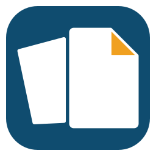
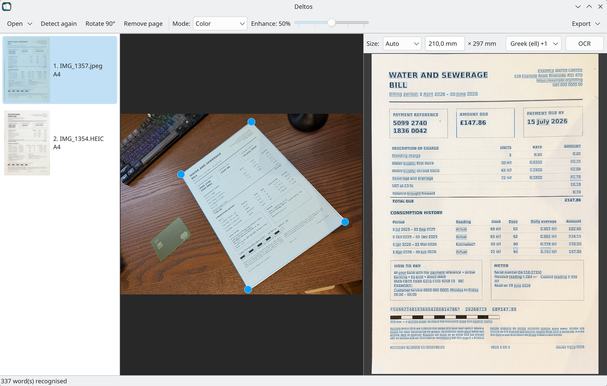
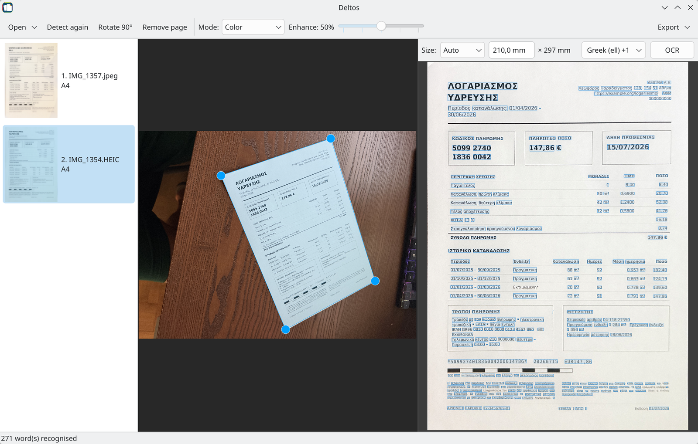

# Deltos

**Photograph a document. Get a scan.**

No scanner, no flatbed, no app on your phone. Take a picture of a page at
whatever angle you happen to be holding the camera, and Deltos gives you back a
flat, upright page — in its real size, ready to file or print.

## Why it is not just a crop

Anything can crop a photo into a rectangle. The hard part is that a photograph
of a page is a *projection* of it: the corners are not square, the sides are not
parallel, and a crop leaves you with a trapezium stretched into a rectangle —
the wrong shape.

Deltos works the geometry back. From the four corners and the focal length the
camera recorded, it recovers the page's **true proportions**, and then its
**real physical size** — so an A4 sheet comes out as 210 × 297 mm, and an ID
card as 85.6 × 54 mm. Export to PDF and the page is that size. Export to PNG and
the density is embedded, so every other program shows it at scale.

And it tells you where that number came from. *Verified* means it was measured
against a card you left beside the document. *Measured* means the camera's own
depth sensor. *Assumed* means it matched a standard paper shape. The label never
claims more than it knows.

## When you want the size to be exact

Most of the time there is nothing to do: a standard page is recognised by its
shape, and an iPhone's depth sensor manages on its own.

When the millimetres matter — a document of no standard size, a drawing to print
at scale — put a card in the photograph, as on the desk above. Every bank card,
licence and hotel key is the same ID-1 format, **85.60 × 53.98 mm** by
international standard, so one in the frame is a ruler you already carry: Deltos
finds it and measures the page against it, **to about one percent**, whatever
the page is.

Lay it flat on the same surface, beside the page and not under it. Angle and
alignment do not matter. The size then reads **Verified** rather than *Measured*
or *Assumed*, and the tooltip says what it was measured against.

## What you get

- **A page that is actually flat and upright.** Perspective undone, lighting
  evened out, rotation corrected — even on a card with three words on it.
- **Real dimensions**, from a card left in the frame, from an iPhone's depth
  sensor, or from the standard shape the page matches.
- **Colour, grayscale or black and white**, with one slider. Colour mode lifts
  shadows and whitens paper without flattening a photograph printed on it.
- **The text, selectable.** Press *OCR* and the words appear over the page.
  Sweep across them with the mouse and copy. Recognition runs in as many
  languages as you like at once, and any of 125 more is one click away.
- **Photos straight from the phone**, full resolution, metadata intact.
- **The same thing from the command line**, for a folder full of photos.

## Get it

Every release carries a package for each system, plus two that need no
installation at all:

| | |
|---|---|
| **AppImage** | one file, make it executable, run it |
| **Flatpak** | `flatpak install deltos-*.flatpak` |
| **Arch, Manjaro** | `pacman -U deltos-*.pkg.tar.zst` |
| **Fedora** | `dnf install deltos-*.rpm` |
| **Debian, Ubuntu** | `apt install ./deltos-*.deb` |
| **Windows** | unpack the zip and run `deltos.exe`; there is an installer too. `deltos-cli.exe` beside it is the one for a command prompt |

**[Download the latest release →](https://github.com/teras/Deltos/releases)**

Nothing is code-signed, so Windows will say so the first time: *More info* →
*Run anyway*. The zip is the gentler of the two — it asks once, where the
installer also wants administrator rights from a publisher it cannot name.

What every release does carry is a `SHA256SUMS` file and a build provenance
attestation, so a download can be checked against what the public build
actually produced:

    gh attestation verify Deltos-1.0-windows-x86_64.zip -R teras/Deltos

Packages need Debian 13, Ubuntu 25.10, Fedora 40, or Arch and Manjaro, or
anything newer. The AppImage and the Flatpak bring their own libraries and run
on older systems too.

## Use it

Open a photo — from the toolbar, by dragging it onto the window, or from your
phone. The detected page appears on the left with its corners marked; drag any
of them if the detector got it wrong. The result is on the right, and the size
row above it says how big the page is and how that was worked out. Then
*Export*.

From a terminal, the same pipeline without the window:

    deltos --no-gui --out scan.pdf photo1.jpg photo2.jpg

`man deltos` has the rest.

### From your phone

Messaging apps shrink photos and strip their metadata — and the metadata is
where the focal length and the camera's depth reading live, which is most of how
Deltos knows the size of things. So it takes the photos directly, over your own
network: turn on *Open → Receive from phone*, then either scan the QR code and
pick the photos in your phone's browser, or send them with the free
[LocalSend](https://localsend.org) app. Nothing leaves the local network, and
nothing needs installing on the phone for the browser route.

## Reading the text

The *OCR* button reads the page in view and draws a box around every word.
Drag across an area and those words are copied — a geometric selection, so
dragging over a column takes that column, not everything printed between its
first and last word.

Languages sit in the menu beside the button; tick as many as apply, and the
order you tick them in is the order Tesseract gets them, which decides the
primary one. *Manage languages…* downloads any of the 125 that upstream
publishes, straight into your own data directory. What your system already
provides is listed there too, and used first.

## License

GPL-3.0-only, see `LICENSE`. The detection model is Apache 2.0
(`models/LICENSE`), from [DocAligner](https://github.com/DocsaidLab/DocAligner);
the bundled QR code generator (`third_party/qrcodegen`, Project Nayuki) is MIT.

---

Building it, how the pipeline works, and how the packages are made:
[DEVELOPING.md](DEVELOPING.md).
